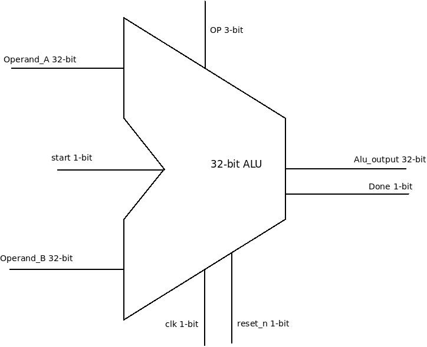
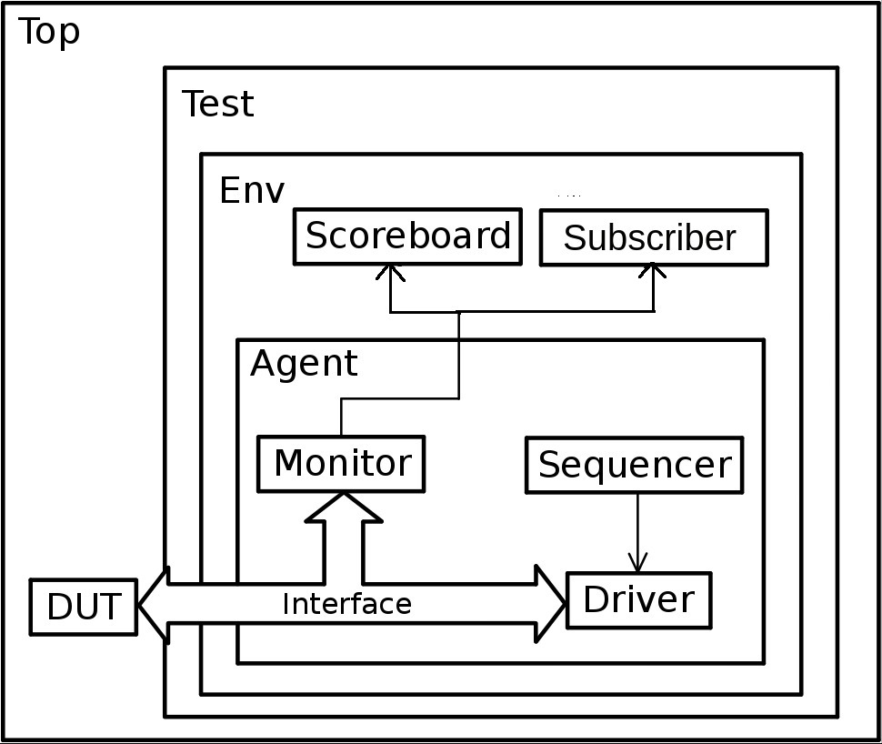

# 32-bit ALU Verification using UVM

## Overview
This project provides a detailed guide for verifying a 32-bit Arithmetic Logic Unit (ALU) using Universal Verification Methodology (UVM). The ALU performs various arithmetic and logical operations on 32-bit operands and outputs a 32-bit result.

## ALU Block Diagram

## ALU Functional Description

The ALU has the following I/O signals:

- **Operand_A [31:0]**: 32-bit input operand A
- **Operand_B [31:0]**: 32-bit input operand B
- **OP [2:0]**: 3-bit operation code
- **Clk**: Clock signal
- **Reset_n**: Active-low reset signal
- **Start**: Start signal to initiate operation
- **Alu_output [31:0]**: 32-bit output result
- **Done**: Output signal indicating operation completion

The 32-bit ALU supports the following operations, selected by a 3-bit OP code:

- **000**: AND
- **001**: OR
- **010**: Addition
- **011**: No Operation
- **100**: Subtraction
- **101**: Multiplication
- **110**: Set if less than

## Verification Plan

### Test Scenarios
1. **Basic Arithmetic Operations**: Test Addition, Subtraction, Multiplication, and Division.
2. **Logical Operations**: Test AND, OR and SLT.
3. **Corner Cases**: Test operations on edge cases like all zeros , all ones, large operand values and overflow conditions.
4. **Randomized Testing**: Generate random Operand_A, Operand_B and OP values to stress test the ALU.

### Functional Coverage
1. **Operation Coverage**: Ensure all operations (Addition, Subtraction, etc.) are exercised.
2. **Operand Coverage**: Cover the full range of possible operand values.
3. **Corner Case Coverage**: Specifically track the edge cases like  all zeros and all ones.

## Verification Environment

The UVM environment for verifying the ALU includes the following components:

- **Top**: Sets up the environment and runs the tests.
- **Test**: Contains the test scenarios.
- **Env**: The environment class that instantiates and connects all UVM components.
- **Agent**: The agent that encapsulates the driver, monitor, and sequencer.
- **Sequencer**: Provides a sequence of transactions to the driver.
- **Driver**: Sends input stimuli to the DUT (Device Under Test).
- **Monitor**: Observes the inputs and outputs of the DUT.
- **Scoreboard**: Compares the DUT output with the expected result.
- **Subscriber**: Collect coverage data.

## File Structure

    .
    ├── rtl
    │   └── alu.v                # RTL for the ALU
    ├── tb
    │   ├── top.sv               # UVM Top
    │   ├── alu_test.sv          # UVM Test
    │   ├── alu_env.sv           # UVM Environment
    │   ├── alu_agent.sv         # UVM Agent
    │   ├── alu_driver.sv        # UVM Driver
    │   ├── alu_monitor.sv       # UVM Monitor
    │   ├── alu_scoreboard.sv    # UVM Scoreboard
    │   └── alu_subscriber.sv    # UVM Subscriber
    │   
    ├── scripts
    │   ├── run_simulation.do    # Script to compile and 
    │
    └── README.md                # This file
